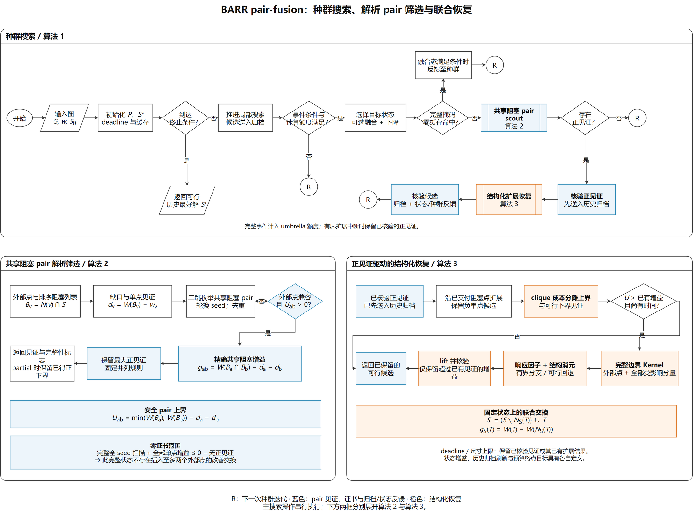

# AAMAS · Joint Recovery · BARR pair-fusion

[中文说明](README.zh-CN.md) · [Algorithm](docs/ALGORITHM.md) · [Model and pseudocode](docs/MODEL_AND_PSEUDOCODE.md) · [Algorithm PDF](docs/barr_model_algorithm.pdf) · [Results](docs/RESULTS.md)

This repository stores the frozen **BARR v0.4 candidate B (`pair-fusion`)** source
used by the B confirmation batch, its eight CP-SCALE-AU-L002 input views, and
the corresponding numerical records. The native mode is `pair` with
`--pair-policy fusion-refine`. The recorded B binary SHA256 is
`fb56e65a09f59762ee6b5c538ab091f0f435bfc939de195dd0737b389ae86cf1`.

The search alternates four persistent local-search trajectories with bounded
opportunity checks. Every fourth eligible gate may fuse the current elite and
its most distant population member. A shared-blocker scout evaluates singleton
and pair replacement witnesses before expanded domains are induced. A verified
positive witness is offered to the historical incumbent before optional
structured recovery, then feeds back into the search population.



[Editable draw.io](docs/figures/barr-pair-fusion-zh.drawio) · [Vector PDF](docs/figures/barr-pair-fusion-zh.drawio.pdf) · [English figure](docs/figures/barr-pair-fusion.drawio.pdf)

## Recorded batches

The objective is total scheduled contact duration. Integer objective ticks are
divided by 1,000,000 to obtain contact-seconds. Within each batch, first average
the available seeds for each view, then average the eight view means equally.

| Recorded algorithm | Batch | Seeds | Runs | Mean contact-seconds |
|---|---|---|---:|---:|
| Candidate B: pair-fusion | B confirmation | 31, 37, 41 | 24 | 1,135,933.207397 |
| Related E: full | F control | 83, 89, 97 | 24 | 1,135,843.516147 |
| Related E: full | E ablation | 71, 73, 79 | 24 | 1,135,645.938579 |
| Related E: pulse-only | E ablation | 71, 73, 79 | 24 | 1,135,740.806759 |

Every listed run uses a 360-second native search budget, population 4 and one
native thread. Internal population initialization belongs to that budget;
external Python preparation, native graph-file reading and post-run auditing
are separately recorded. The [results specification](docs/RESULTS.md) contains
per-view and per-seed values, timing and source identities.

## One branch

`main` contains the B algorithm, all its shared components, the related E
source, B development/confirmation results and E/F records. The frozen trees
are kept separately named: `native/BARR_v0.4B` and `related/BARR_v0.4E`.
Their file hashes are listed in [frozen_sources.json](provenance/frozen_sources.json).

## Build and run

Linux or WSL; Python 3.10+, NumPy, GCC/Clang with C++17. CMake is optional.

```bash
git clone https://github.com/Mister-Ryder/AAMAS-JointRecovery-BARR.git
cd AAMAS-JointRecovery-BARR
python3 -m pip install -r requirements.txt
python3 scripts/verify_records.py
python3 scripts/build_native.py --tests
python3 scripts/run_pair_fusion.py --graph g0340 --seed 31 --seconds 360 \
  --out run_outputs/g0340_B_seed31
```

The entry point uses the frozen profile explicitly and requires a new output
directory. Its `--dry-run` option prints the command without starting search.
The original native CLI and legacy scripts remain byte-identical under their
frozen source directory. For the related E source:

```bash
python3 scripts/build_native.py --variant E --tests
python3 scripts/run_pair_fusion.py --variant E-full --graph g0340 \
  --seed 83 --seconds 360 --out run_outputs/g0340_E_full_seed83
```

`--variant E-pulse` uses the same E executable with `--pair-component pulse-only`.
The original historical executables are identified by hash; local compiler,
CPU and wall-clock scheduling determine a rebuilt executable and search path.

## Layout

| Path | Contents |
|---|---|
| `native/BARR_v0.4B/` | 47 frozen B source and fixture files |
| `related/BARR_v0.4E/` | 50 related E source and fixture files |
| `profiles/pair-fusion.json` | Explicit historical B search parameters |
| `data/CP-SCALE-AU-L002/` | Original and normalized eight-view inputs |
| `results/B/` | B confirmation 144 records and development 50 records |
| `results/E/`, `results/F/` | Related 48-run ablation and 48-run CHILS4 control |
| `results/all_runs.csv`, `results/summary.json` | Batch-specific tabular records and exact rational means |
| `provenance/` | Input/source hashes, frozen protocol and numerical verification |
| `docs/` | Technical specification, pseudocode and editable figures |

The source and result extraction keeps the original files unchanged. The
publication check reconstructs all 290 copied integer objectives, checks every
conflict edge and checks both satellite and antenna resource timelines.
The [release validation](provenance/release_validation.json) records the native
input hash checks and four B property suites (99,226 assertions). The
[visual validation](provenance/visual_validation.json) records PDF rendering,
single-page figure exports and embedded diagram checks.
The original MIT licenses are retained. Baseline attribution is in
[THIRD_PARTY_NOTICES.md](THIRD_PARTY_NOTICES.md).
